# 小鲸鱼挂件 · W 魔改版（dsh-whale-widget-w）

基于 [MeteorNOX/DeepSeek-Balance-Whale-Widget](https://github.com/MeteorNOX/DeepSeek-Balance-Whale-Widget) `0.3.5` 的功能增强版，当前版本 `0.3.5-w.3`。
**原版全部功能保留**，新增功能集中在主菜单的「W ▸」功能面板与「泡泡管理」窗口。

- 适用于 DSH Web（DeepSeek 网页版挂件）。
- 插件名 `dsh-whale-widget-w`，与原版 `dsh-whale-widget` 的 bundle id 不同，**两者可同时安装**（但同时启用会注册同名路由，建议只启用一个，见第七节）。
- 已同步上游 0.3.6 ~ 0.3.9 的全部修复（新版 DSH 挂载兼容、Codex 统计不阻塞、浮层残留、音效手感、法定节假日谷价）。
- 美术素材版权说明见 [PROVENANCE.md](PROVENANCE.md)。
- 遵循原项目的 MIT License 开源。感谢原作者 MeteorNOX 及所有贡献者 —— 挂件绘制、记账模式、峰谷定价、每轮消耗统计等核心设计均出自原项目。

---

## 版本沿革与适配范围（先读这两段）

**版本关系**：本插件魔改自原版 `dsh-whale-widget` **0.3.5**，并同步了上游 **0.3.9** 的部分补丁，当前为 **W3**（版本号 `0.3.5-w.3`）。W3 基本保留了原版绝大部分功能，把旧版 **W2** 针对 DeepSeek 开发的能力整体迁进来了 —— 集成在「W ▸」面板（面板右下角点 W 切换），原版的「新建气泡」全部迁到「**泡泡管理**」，并在其上做了魔改：新增**气泡分组管理**、逐颗开关与权重、打标与生态联锁、图库上传自动压缩等。W 面板本身也只迁了 W2 里重要的那部分：常驻显示、DeepSeek 峰时锁定 / 谷时提醒、以及针对 DeepSeek 官方 API token 用量的**前端 + 校准模式**（需配合油猴脚本，见第四节）。新增了**生态面板**：目前只做了 DeepSeek，下拉里的智谱 / 千问是**占位**，下一个开发的是智谱。

> ⚠️ **W1 / W2 已停止维护**。它们基于原版 **0.2.10**，是相对轻量的版本，里面有些功能与设置项已经过时，配置和文档都不要拿来和 W3 对照。

**适配范围（重要）**：

- **只适配 DSH**。部分功能直接依赖 DSH 的内置插件 —— 最典型的就是 token 用量统计的「前端模式」，数据来自 DSH 自己的会话统计。换别的宿主这些功能跑不起来。
- **生态适配针对的是官方 API 与官方 Plan**（目前只有 DeepSeek）。如果你是通过**聚合站**调模型，本插件的部分功能会失效，最典型的是**用量校准模式**（聚合站的账单对不上 DeepSeek 官方后台）；余额接口、峰谷计价同理。
- 非 DeepSeek 生态的适配进度取决于作者的使用偏好（性价比优先）。多数模型厂商都有自己的专武 harness，所以**这部分推进不会很积极**，请以仓库实际提交为准，不要按"迟早都会有"来预期。

## 文件结构

装完之后磁盘上的样子（源码目录 = npm 包内容）：

| 路径 | 角色 |
|---|---|
| `lib/index.js` | **宿主侧插件本体**：注册 `/dsh-whale/*` 全部路由、余额与用量记账、节假日峰谷判定、图库/角色/音频服务、W 设置镜像落盘 |
| `lib/accounting.mjs` | 记账内核（定点金额运算 + 余额观测/校正账本），被 `lib/index.js` 引用 |
| `assets/whale-widget.js` | **前端挂件本体**（约 1.8 万行，界面、分组、轮播、面板全在这里）。宿主按 mtime 热读取 —— **改前端只需浏览器 Ctrl+F5，改宿主必须重启 dsh** |
| **`assets/dsh-whale-token-sync.user.js`** | ★ **油猴（Tampermonkey）脚本就是这个文件** —— 平台令牌同步用的那一个。你不需要手动打开它：浏览器访问 `http://127.0.0.1:3080/dsh-whale/token-sync.user.js`，由宿主下发并自动带上你的地址，Tampermonkey 会弹出安装页（详见第四节） |
| `assets/*.gif` / `*.png` / `*.mp3` / `*.wav` | 内置美术与音效素材（版权口径见 [PROVENANCE.md](PROVENANCE.md)）：`rua.gif` 鲸鱼动图、`bubble-petpet.gif` / `bubble-money1.gif` 内置泡泡图、`DSniang1.png` 小鲸鱼本体、`Ya*.mp3` / `D*.mp3` 预置音效、`minecraft-exp-orb.wav` / `task-end-a.wav` 任务结束音 |
| `cordis.patch.yml` | 插件挂载声明（把挂件插进 DSH 的 Web profile 配置树），bundle id 为 `dsh-whale-widget-w` |
| `package.json` | 包名 / 版本 / `files` 清单 / DSH bundle 入口 |
| `docs/` | 本文件引用的界面截图 |
| `README.md` | 上游沿用的总说明（含原版功能与目录） |
| `README-W.md` | **本文件**：W 版功能说明 |
| `DEV-NOTES.md` | 开发者备忘录：存储键、已知坑、路由清单、年度维护（更新节假日表看第 6 节） |
| `PROVENANCE.md` | 美术素材版权与来源说明 |
| `LICENSE` | MIT |

运行时数据都在 `$DSH_HOME`（默认 `~/.dsh`）：`.dshw-bubble.json`（泡泡配置）、`.dshw-w.json`（W 面板设置的宿主镜像）、`.dshw-tokens.json` / `.dshw-usage.json`（账本）、`.dshw-platform-token.json`（平台令牌）、`whale-bubble-imgs/`（你上传的图库）、`whale-roles/`、`whale-audio/`。完整口径见第九节。

---

## 一、W 功能面板

主菜单点「**W ▸**」进入功能面板，DeepSeek 生态的常用设置集中在这里：

| 项目 | 说明 |
|---|---|
| 常驻 | 勾选要常驻显示的分组；全不选 = 无，全选 = 随机轮换 |
| 轮播 | 常驻气泡自动切换的间隔秒数（0 = 不自动切换，点气泡手动切换）；拖动滑条时右侧数字实时跟随 |
| 方式 | **随机轮播**（到点按权重抽）/ **顺序轮播**（勾选的泡一轮全部放一遍） |
| 峰谷 | 「峰时锁定」「谷时提醒」两个**功能的总开关**（锁发送按钮 / 谷时提醒这套行为开不开）；单颗提醒泡要不要弹，去组管理里该条行首的勾 |
| 用量统计 | 显示当前统计模式：未连接平台令牌 = 前端模式；已连接 = 前端+校准模式（灯色随校准状态变化） |
| 校准阀值 | 官方校准的判定百分比，90–100 的整数，默认 90 |
| 生态 | 面板最底行（「◂ 原版」下面）：切换生态（联动角色），**右侧「联锁」勾选框**= 禁用没打当前生态标的气泡与功能（「无」不受限），不勾 = 无禁用 |
| ◂ 原版 | 返回原版主菜单（原版全部设置仍在） |

底部「**恢复全局默认设置**」把 W 面板与原版面板的**设置**恢复到本版基线（= 本版调校完成时的状态）：常驻=无、轮播 3 秒 + 顺序轮播、分组回三组 **A 随机对话 5 / B 数据显示 10 / C 触发提醒 5**（余额卡与今日/本月用量进 B，其余点击泡**连同你已有的自定义泡**进 A，系统提醒与三条触发提醒进 C，自定义泡的组归属记录一并固化）、逐颗开关全开 + 权重（q1 = 2）+ 打标（f0 = DeepSeek、f1 = 智谱）+ 重命名（两条用量泡的「deepseek用量明细·今日/本月用量」）都回这套基线、生态回 DeepSeek 且**联锁回勾选**、峰谷三开关全开、校准阀值 90、原版面板各项（尺寸 1.0 / 音量 0.9 / 音效 duck / 气泡启用 / 每轮消耗 / 滚动间隙 / 菜单按钮）回默认。**泡泡内容（点击队列、模块字号、图片显示大小、自定义泡）、触发泡的自定义文案、图库、余额与用量记录都不受影响** —— 要单独重置某条触发泡，去它的编辑器里点「恢复默认」；要重置整条点击队列，用「泡泡管理 → 重置」。

**生态 / 角色 / 模型的联动（内置，无需设置）**：

1. 在「配套生态」选智谱 → 角色自动切到 **Z狐**；选千问 → 自动切到 **千问**；选回 DeepSeek → **小鲸鱼**。你还没导入过对应角色时，只换生态面板、不动当前皮肤。
2. 在 DSH 的模型选择器里切到 `glm*` / `qwen*` 模型 → 生态自动跟着切过去（角色再由第 1 条带上）。
3. 反过来不成立：**切生态不会去动你的模型选择器**，该用哪个模型还用哪个。
4. 你在角色列表里手动点角色 = **只换皮肤**，不改生态也不改模型；重启/换浏览器时生态会恢复，但不会强行把皮肤改回去。
5. **气泡打标（多选）**：每颗泡/每条提醒的「✎ → 显示设置」里都有「打标」勾选面板，样式和「常驻」一样：`无 / DeepSeek / 千问 / 智谱`，**可以勾多个**。一个都不勾（= 无）表示通用。没手动打过的按内容自动推导 —— 数据或素材来自 DeepSeek 的那些（用量明细、余额类提醒、峰谷触发泡、含随机台词/鲸鱼图的点击泡）默认勾 **DeepSeek**，其余默认 **无**。
6. **生态联锁**（生态行右侧的勾选框）：勾上后禁用「没打当前生态标」的条目；**「无」不受联锁影响**。举例：一颗泡勾了 DeepSeek+千问，那么在 DeepSeek 和千问生态下都出现，切到智谱生态就消失。不勾联锁 = 无禁用，一切照旧。**约束范围覆盖所有出口**：常驻轮播、点击鲸鱼的序列泡、余额预警 / 今日预算 / 每轮消耗三种系统提醒、年表过期 / 谷时将尽 / 峰时锁定三条触发提醒（连页面顶部那条红色过期提示条也一起走这个判定）。
7. 内置规则（原来是一条条勾选框，与联锁重复，已删）：**只勾了 DeepSeek 一个标**的条目，在当前模型不是 DeepSeek 时自动隐藏（它按 DeepSeek 的价目表与余额出账，换模型显示的是错数据）；如果你给它同时勾了别的生态标，就不受这条限制。

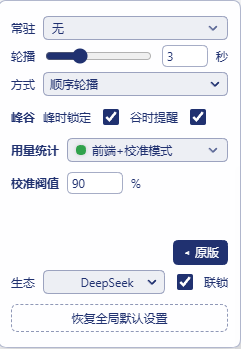
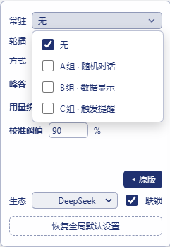
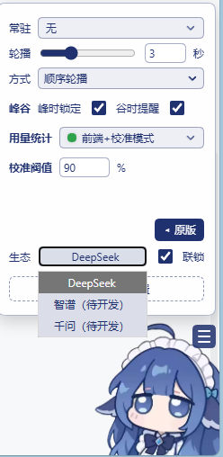
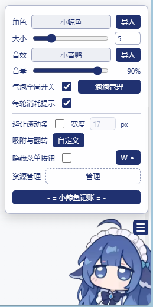

## 二、泡泡管理（组管理系统）

主菜单「**泡泡管理**」→「组管理」，可对**整颗气泡**和**系统提醒**做分组管理：

- 出厂三个组：**A 组 · 随机对话 / B 组 · 数据显示 / C 组 · 触发提醒**；新建泡泡自动进「未分配组」。
- 每组可改名、排序（↑↓）、设置**组权重**（1–99，权重越高常驻轮换时出场份额越大）。
- 「+ 添加点击泡泡」向点击顺序追加气泡；「+ 自定义泡泡」创建不占点击顺序的自由泡泡。
- 条目同一时刻只属于一个组，在各组「编辑」的下拉框里认领归属；组内条目带 A001/B001 式编号。
- **每颗泡行首有独立开关**（默认开）：关掉后这颗泡既不进常驻轮播，点击鲸鱼时也会跳过它；与组权重、触发条件互相独立。
- **每颗泡行内有权重输入框**（1–99）：决定它在**组内**的出场次序（顺序轮播）与出场份额（随机轮播）；默认沿用该泡配置里的内置权重。
- **删除气泡的入口在未分配组**：组里的 ✕ 只是「移出本组」；到未分配组里点 ✕ 才会**真正删除**这颗泡（需二次确认，不可恢复），各组引用会自动重编号。系统提醒与今日/本月用量是内置条目，不能删。
- **两处删除入口是同步的**：「泡泡管理」初始面板里每行的 ✕（删点击顺序的一步）与组管理里的真删走同一套重映射 —— 删掉一步之后，组归属、逐颗开关、逐颗权重、打标、重命名都会自动挪到剩下的泡上；在编辑器里**拖动换序**也一样，归属跟着那颗泡走而不是跟着位置走。删除没写进服务端时（宿主没跑、磁盘出错），本地这几张表会**整批还原**并提示重试，不会留下错位的半成品。
- **每颗泡的 ✎ 都是「显示设置」**：第一项是**名称**（重命名，只改行名中间那段：`A001 骂人泡 · 随机语句` —— 序号和模块摘要照实自动生成），第二项是**打标**勾选面板（`无 / DeepSeek / 千问 / 智谱`，可多选，见第一节第 5 条），并显示当前联锁下这条是放行还是禁用；下面「编辑内容/样式」一键进原有编辑器。
- **DeepSeek 绑定条目**：今日用量、本月用量、余额预警、今日预算、每轮消耗、节假日表过期、谷时将尽、峰时锁定这八条，加上**内容来自 DeepSeek 的点击泡**（用了「随机语句」台词池或「图片/动图」模块的那几颗 —— 按内容自动判定，不写死编号）默认就勾着 DeepSeek 标，所以切到非 DeepSeek 模型时整批自动隐藏（常驻不出现、点击序列里也跳过、不再弹泡），换回 DeepSeek 即恢复；面板里会显示当前判定依据（来自模型选择器，其次才是最近一轮）。原来那条「仅 DeepSeek 模型时显示」的逐条勾选框已删（与生态联锁重复）。
- **图库上传会自动压缩静态图**：编辑器里的「上传图片」认 png / gif / jpg，单张上限 32MB，**格式按文件真实内容判定**（把 jpg 改名成 .png 也能正确入库并正常显示，不再出现"传上去了却是空的"）。**png / jpg 在你本机先压再上传** —— 最长边超过 800px 就等比缩并重编码（png 保留透明通道，jpg 质量 0.9），原本就不大于 600KB、或压完反而更大的直接原样传；压成功会弹一句「已自动压缩：9.5MB → 768KB，尺寸 4320×4504 → 767×800」。**GIF 与 APNG 一律不动**（过一遍 canvas 就只剩一帧，第三节那条「动图优先放完」也就废了），所以大图若是动图，得自己先压。上传失败一定把原因原话弹出来，不会再出现"点了没反应"。
- 说明：**出厂默认序列里不再有 A/B 并列加权随机泡**，旧配置升级时自动摊平成顺序队列（原来并列的两颗各占一步）；编辑器里你仍然可以自己把两颗泡拖成并列，只是不再作为出厂形态。

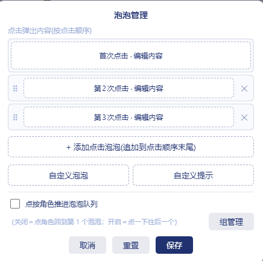
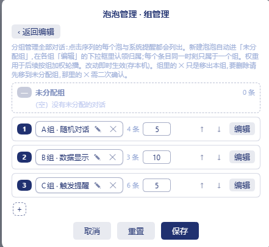
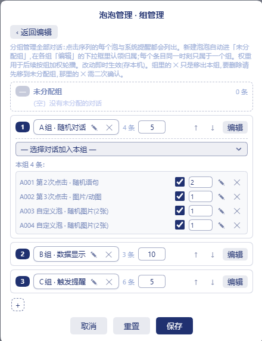
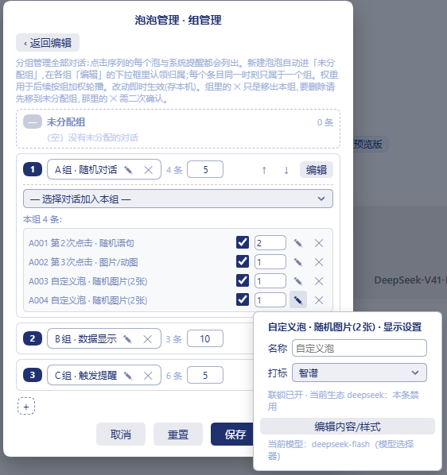

## 三、常驻显示与轮播

- 常驻气泡悬浮在鲸鱼头顶，与点击鲸鱼弹出的泡泡是同一种形态、同一个位置，点击可切换到下一颗。
- **随机轮播**：到点按「组权重 → 组内气泡权重」两级加权抽取；**今日用量与本月用量成对出现** —— 轮到今日用量，下一次必然是本月用量，本月用量也不会单独打头。
- **顺序轮播**：勾选的泡一轮全部放一遍再重排下一轮；出场次序先由组权重决定哪组先出场，再由组内权重决定该组内部先后。
- 提醒类条目（预警 / 预算 / 每轮消耗 / 触发提醒）即使勾选了所在组，也要**开关启用且触发条件达成**才会进入常驻轮换；条件消失自动退出。
- **动图优先放完**：常驻轮到 GIF / APNG 时，以「完整放完一圈」为准，不受轮播秒数截断（放完的下一瞬才切走，不会多等一轮）；一圈时长直接从图片字节里解析（GIF 帧延迟 / APNG fcTL），静态图与文本泡仍严格按轮播秒数停留。
- 炫彩（流光）文字的动画相位与墙上时钟同步，泡泡内容刷新时不会从头重播。

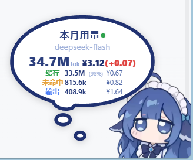

## 四、今日 / 本月用量明细

B 组自带「今日用量」「本月用量」两张明细泡：

- 大号 token 总数 + 金额，下方**缓存 / 未命中 / 输出**三行分项明细（含缓存命中率与分项金额，标签列居中对齐）。
- 金额按 DeepSeek 官方价格表峰谷计价；官方真实金额高于本地估算的部分以红色 `(+0.07)` 标注**峰时多付**。
- 标题旁指示灯：**灰** = 未连接平台令牌；**黄** = 已连接、有待校准新增；**绿** = 已按官方数据校准。

**为什么要有"前端 + 校准"两套数（设计理念）**

这套设计改造自 DSH 自带的 token 用量统计，两者各有短板：

| | 前端统计（DSH 内置） | 官方后台（platform.deepseek.com） |
|---|---|---|
| 响应速度 | **快**，调完就有 | 慢，出账有延迟 |
| 口径 | 不一定和官方对得上 | **计费以它为准** |
| 连续性 | 切换对话 / 换机器会重置 | 与设备无关 |

本插件做的事就是把两者接起来：

1. **官方还没出账时 = 前端模式**，实时统计当前用量，指示灯**黄**（已连接令牌、但还有没校准进来的新增）。没装油猴脚本则一直是**灰**，此时纯本地账本口径。
2. **模型调用进入静默期后自动校准**：油猴脚本把平台令牌推给本机，宿主拿令牌去官方后台取真实用量，与本地账本比对后**提交校准基线**。阀值预设 **90%** —— 官方用量达到本地账本的 90% 才提交，避免官方出账延迟把用量校丢。校准完成后指示灯转**绿**。
3. **校准之后又产生了新的模型调用 → 自动切回前端模式**，此时显示的用量 = **上一次的校准基值 + 前端新增统计**。好处是：即使你换对话、换设备，只要油猴脚本正常运行，用量气泡显示的仍是准确的今日用量，**不会因为数据只留在本地而出现断层**。今日 / 本月各自独立校准。
4. **消费金额同样会被校准**，就是用量大字那一行：**蓝色**金额 = 按谷价计算的 token 消费，括号里的**红色** = 校准后发现峰时多付的部分，**两者相加才是真实付出去的价** —— 溢价多少一眼看得到。

> 一个使用体感：走令牌模式的校准值，比你自己去网页上刷新大约**快半轮**（个人观察，非精确测量）。

对照参考 —— 上面「前端统计」那一栏的数据源就是 DSH 自己这个面板：

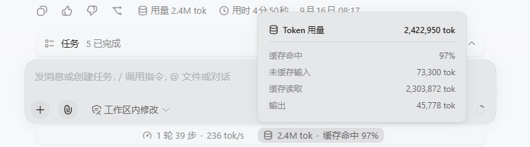

**平台令牌配置（可选，三步）**：

1. 浏览器安装 Tampermonkey 扩展；
2. dsh 运行中，浏览器打开 `http://127.0.0.1:3080/dsh-whale/token-sync.user.js`，按提示安装脚本（端口以你的 dsh 地址为准）；
3. 打开并登录 [platform.deepseek.com](https://platform.deepseek.com)，刷新一次页面。

验证：在平台页面按 F12，控制台出现 `[dsh-whale] 平台令牌已同步到本地 DSH 挂件` 即成功。令牌只从官网发往你本机 `127.0.0.1`，不经过任何第三方；重新登录平台后脚本会自动推送新令牌。


> 📷 配图位置 5：Tampermonkey 安装页（建议文件 `docs/screenshot-tampermonkey.png`，待补）

## 五、节假日峰谷

- 峰谷判定与官方口径一致：**周一至周五（不含中国法定节假日）9:00–12:00 / 14:00–18:00 为高峰**；其余时段 —— 包括周末、调休上班的周末、以及**法定节假日全天** —— 一律按空闲计价。
- 节假日清单由宿主单一来源下发（内置 2026 全年表），前端倒计时与计费同一口径；下一个切换点也由宿主算好下发，避免长假期间倒计时算偏。
- **峰时锁定**：高峰时段进入 DeepSeek 会话时隐藏发送按钮并拦截回车发送，谷时自动恢复；同时弹出锁定提醒泡。
- **谷时提醒**：谷时剩余 ≤ 30 分钟时弹出「谷时将尽」提醒泡（每个谷期一次）。
- 年表过期（一般是次年未更新）时页面会弹红色提示条，同时弹「节假日表过期」触发泡 —— 两者走同一个开关（组管理里 C004 行首的勾），关掉就都不弹；更新方法见第八节。

## 六、触发提醒泡

C 组三条触发提醒 —— **节假日表过期 / 谷时将尽 / 峰时锁定** —— 内容均可自定义：

- 在组管理清单里点「✎」先进显示设置，再点「编辑内容/样式」打开编辑窗口，与原版泡泡编辑器同款操作：可选模块、拖拽排序、真实预览、恢复默认。
- 编辑窗口顶部「触发条件」区**只说明这条什么时候会弹**，不再放开关（原来这里和组管理的行首开关重复，已合并成一个）。**启用 / 停用统一用「泡泡管理 → 组管理」里本条行首的那个勾**：关掉后这条提醒既不弹泡，也不进常驻轮换。
- 「峰时锁定」「谷时提醒」在 W 面板峰谷区还各有一个勾，那是**功能总开关**（管"峰时要不要隐藏发送按钮、拦截回车"这类行为），和上面管"这颗泡弹不弹"的行首开关不是一回事，两个各管一层。

## 七、安装与升级

前提：已安装并能在本机跑 DSH Web。

```powershell
# 方式一：本地资源包（解压到一个以后不会移动的固定目录，目录里直接有 package.json）
dsh plugin --profile web add link:C:\你的路径\dsh-whale-widget-w

# 拷贝式安装（此后改源目录不会同步，需重新 add）
dsh plugin --profile web add file:C:\你的路径\dsh-whale-widget-w

# 方式二：从 GitHub 安装（推荐）
# 本仓库是「插件集合」：main 分支只是开发用的目录结构（根目录没有 package.json，
# 不能直接装），每个插件发布在**自己的同名分支根目录**上。本插件 = whale 分支。
dsh plugin --profile web add github:WIMIN144/DSH#whale
```

> ⚠️ 别填成仓库根地址或 `main` 分支 —— 那是插件集合，装不了；也**不要**指望用 `.../tree/main/dsh-whale-widget-w` 这种子目录地址，安装走的是 npm 的 git 安装，只认「分支根目录就是一个包」。

**方式三：在 DSH 网页里直接装（较新版本才有）**。如果你的 dsh 已经有插件管理页，打开 **设置 → 插件 → 插件管理**，在输入框里填下面这一行，点「安装」，然后**重启 dsh** 生效 —— 不需要再回命令行：

```
github:WIMIN144/DSH#whale
```

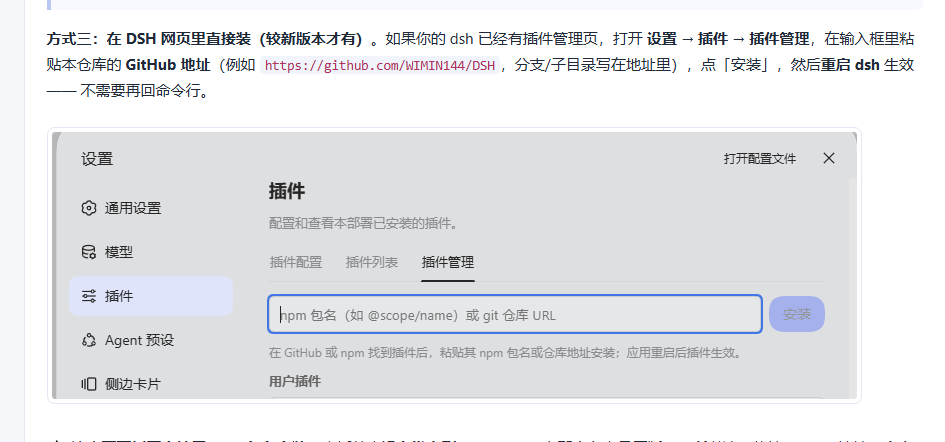

⚠️ 这个页面**暂不支持用 npm 包名安装**，本插件也**没有发布到 npm**（npm 上那个名字是原版），所以请一律填 GitHub 地址。命令行方式（方式一/二）不受这个限制，两个都能用。

安装后**重启 `dsh web`**，再在浏览器 Ctrl+F5 刷新。

**与原版共存**：两者 bundle id 不同，可同时装；但同时启用会注册同名 `/dsh-whale/*` 路由、共用同一份 `~/.dsh/.dshw-*.json` 状态，行为不确定。建议只启用一个 —— 编辑 `~/.dsh/profiles/web/cordis.patch.yml`，把不想用的那条改成 `disabled: true`，重启 dsh 即可（无需卸载）。

**升级**：`dsh plugin --profile web add` 重装同名包即可；设置与账本都在磁盘文件里，升级不丢。

**卸载**：`dsh plugin --profile web remove dsh-whale-widget-w`。

## 八、年度维护（更新节假日表）

每年国务院公布下一年放假安排后，更新插件内的节假日年表并重启 dsh。具体文件位置与操作步骤见开发者备忘录 [DEV-NOTES.md](DEV-NOTES.md) 第 6 节。

## 九、数据与隐私

挂件只在**你本机**工作，没有任何遥测、统计上报或第三方接口：

| 数据 | 存放位置 | 说明 |
|---|---|---|
| DeepSeek API Key | DSH 凭据服务（`~/.dsh/.credentials.yaml`） | 由 DSH 管理，插件只按凭据名读取，用于向 `api.deepseek.com` 查余额 |
| 平台网页令牌 | `~/.dsh/.dshw-platform-token.json` | 仅本机；由油猴脚本从官网推送到 `127.0.0.1`，只用于向 DeepSeek 官方后台核对用量 |
| 余额 / 用量账本 | `~/.dsh/.dshw-tokens.json`、`.dshw-usage.json` | 只有 token 计数、金额与日期，不含会话正文 |
| 外观与设置 | `~/.dsh/.dshw-size.json`、`.dshw-bubble.json`、`.dshw-w.json` | 泡泡内容、分组、轮播、开关等；`.dshw-w.json` 是 W 面板设置的宿主镜像 |
| 当前模型名 | 不落盘 | 宿主读 DSH 自己的 `settings.yaml`，用于判断用量类气泡该不该显示 |

- 所有对外的网络请求只指向 **DeepSeek 官方域名**（余额接口与平台后台用量接口）。**带密钥外发的那一类请求（自定义 API 模型）不跟随重定向** —— 遇到 302 直接报错并让你把 Base URL 填成最终地址，避免密钥被顺带送到跳转后的域名。
- 自定义 API 模型面板允许你自己填 Base URL —— 那种情况下密钥只会发往**你填的那个地址**。「凭据名」写进的是 DSH 凭据库里的同名条目，**只填你自己为这个服务新建的名字**，复用别的服务已有的名字会覆盖或删掉那一条；凭据名限定为字母、数字、`_ . -`（长度 ≤64），防止把 YAML 结构字符写进凭据文件。
- 本地接口只监听 `127.0.0.1`，且所有 `/dsh-whale/*` 响应都要过 DSH 的浏览器信任校验（Host/Origin 被伪造会被拒），**不带跨源可读的 CORS 头**：其他网页既读不到也改不了挂件数据。唯一允许跨源的是平台令牌同步端点：只接受 `POST`，来源必须**精确等于** `https://platform.deepseek.com`（前缀伪造如 `platform.deepseek.com.evil.tld` 一律 403），响应也不带 CORS 头，所以第三方页面既读不到返回、也塞不进伪造来源。
- 令牌与自定义 API 注册表这两个文件按 **0600** 落盘（POSIX 下同机其他账号读不到）。图库上传的图片**按文件真实内容判定格式**（PNG/JPEG/GIF 魔数），改过后缀的文件不会再以错误格式入库。
- 换浏览器或换电脑时，W 面板设置会从本机 `.dshw-w.json` 自动回填，不再依赖浏览器本地存储。

## 十、常见问题

- **指示灯是灰的？** 未连接平台令牌，用量为本地账本口径；按第四节三步配置即可。
- **指示灯黄了不变绿？** 官方出账有延迟，官方数据追上本地后自动校准变绿；也可把「校准阀值」调低试试。
- **余额 / 用量数字与官网不一致？** 本地账本实时、官方出账延迟，属正常现象；静默期后会自动对齐。
- **峰谷判断不对？** 检查年表是否过期（页面会有红色提示条），并确认系统时区设置正确。
- **切到别的模型后用量气泡不见了？** 这是内置的 DeepSeek 门控在生效：那条气泡只打了 DeepSeek 一个标，而它显示的是按 DeepSeek 价目表算的数，换模型就是错数，所以整批自动藏起来。三种放行方式，按需要选：① 在该条 ✎ 的「打标」里再勾上当前生态（例：DeepSeek + 千问）；② 把该条的勾全部去掉（=「无」，不受门控也不受联锁限制）；③ 关掉「生态联锁」。换回 DeepSeek 模型则什么都不用动，自动恢复。
- **换了浏览器 / 换电脑，分组和开关没了？** 确认 `~/.dsh/.dshw-w.json` 在；设置跟着这台机器的 DSH 走，不跟浏览器走。
- **挂件在新版 DSH 上不出现？** 请更新到本版本；0.3.5-w.3 起兼容新版 composer 结构（上游 issue #123 同源修复，已在本机 dsh `0.1.5-rc.3` 实测挂载正常）。
